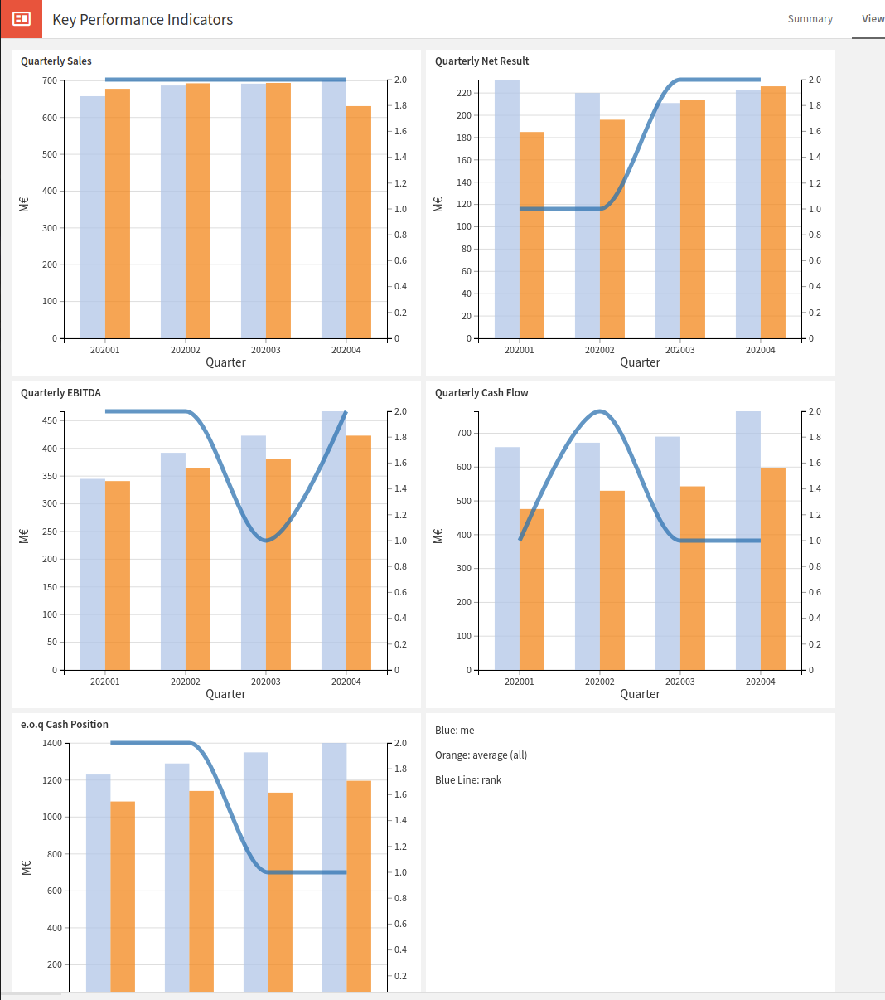

# MPC: secret ranking of 3 entities along 5 Financial Performance Indicators

This algorithm demonstrates how 5 business entities can rank each other over a period against 5 financial criteria without disclosing the actual values of this criteria to each other.

Typically, each entity all provide a dataset with 6 columns:

 - quarter (in YYYYQQ format)
 - quarterly sales
 - quarterly net result
 - quarterly EBITDA
 - quarterly cash flow
 - end of quarter cash position

 The computation will reveal to each participant, for each quarter and each criteria:
 - the sum of the values of all participants for that criteria
 - the rank (1, 2 or 3 descending) of the participant for that criteria

Results of this computation can be nicely post-processed and rendered in Dataiku thanks to the [Cosmian Dataiku Plugin](https://github.com/Cosmian/cosmian-dataiku-plugin)




## Hack it !

The code is documented and under MIT license as it is meant to be hacked for your purpose.

It is actually very easy to generalize this code to most confidential Key Performance Indicators comparisons across entities with minor modifications.

Do not hesitate to open issues and PRs to improve the quality of this code 
and its documentation.

## Editing and testing

Once you have cloned this repository locally, edit the code; 
we recommend that you use the free VSCode and rust-analyzer extension.

To check the validity of your code, simply run  `cargo build`. 
The build process outputs [WASM](https://fr.wikipedia.org/wiki/WebAssembly) which
is what is actually fed as an intermediate representation to the CipherCompute engine.

To facilitate testing without having to run [CipherCompute EAP](https://github.com/Cosmian/CipherCompute),  2 facilities are provided via 2 scripts:

 - `emulate.sh` will pick up the input data in the `data/inputs` directory 
  and output its results in the `data/outputs` directory. These directories contain one 
  file per player. This scripts perform the same emulation as that provided on the CipherCompute UI. 

 - `test.sh` will run the unit tests of the `main.rs` file. For a test written 
   ```rust
   #[test]
    fn test_example() {
        // An example of a successful test
        // which input and expected output data are located
        // in the `fixtures/success_test` folder
        cosmian_std::test!("success_test");
        // If you change any data in the input or output files,
        // the test will fail
    }
    ```
    The input data will be picked up from the `fixtures/success_test/inputs` directory and
    the outputs will be **compared** to those of the `fixtures/success_test/outputs` directory.

## Testing inside the CipherCompute MPC engine

1. Make a change and test it using `./simulate.sh`
2. commit the change to the local git and note the git commit

3. Then use the `git-daemon.sh` script to launch a git daemon which exposes this project at
`git://localhost:9418/mpc_millionaires`

From the UI on the CipherCompute EAP version

4. Create/update a computation using the git URL above and the git commit you want to test
5. Run the computation from the UI

See the [CipherCompute EAP](https://github.com/Cosmian/CipherCompute) Quick Start Guide
on how to use its UI to configure a computation.
